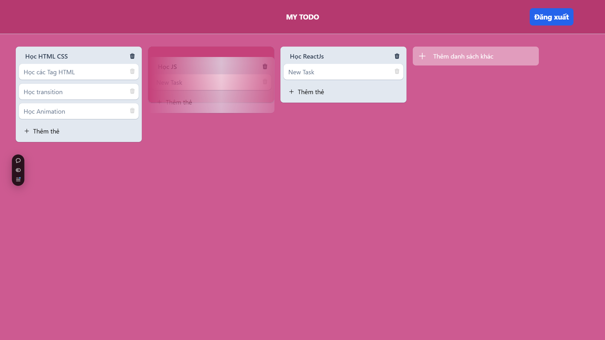
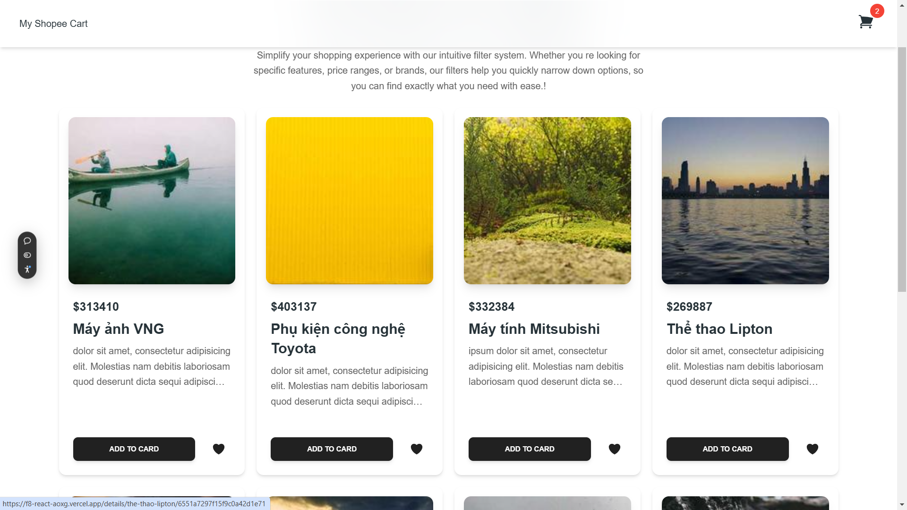

# F8-React JS

- Đây là một Repository chứa các bài tập trong quá trình học ReactJs của tôi:

- Bao gồm các chủ đề: 
- Lesson44: Bắt đầu làm việc với Component trong React xây dựng một giao diện đơn giản
  - [Demo](https://buiduong2.github.io/F8-React/lesson44/dist/) 
  - [Source Code](./lesson44/)

- Lesson45: làm việc với State thông qua ứng dụng TODO APP
  - [Demo](https://buiduong2.github.io/F8-React/lesson45/todo-app/dist/) 
  - [Source Code](./lesson45/)

- Lesson46: làm việc với Global State là Context. Thông qua ứng dụng Shop-cart
  - [Demo](https://duong-lesson-46.vercel.app/) 
  - [Source Code](./lesson46/)

- Lesson47: Làm việc với Auth0. Và Email Service được cung cấp bởi bên thứ 3: 
  - [Demo](https://f8-react-drsw.vercel.app/) 
  - [Source Code](./lesson47/)

- Lesson48: Một ứng dụng trò chơi đơn giản đoán số.
  - [Demo](https://f8-react-87rp.vercel.app/) 
  - [Source Code](./lesson48/)

- Lesson48: Làm việc với react Router DOM
  - [Demo](https://f8-react-aoxg.vercel.app/products) 
  - [Source Code](./lesson49/)

- Lesson50: Clone Trello Board. Học tập sử dụng DND-kit. ứng dụng kéo thả, Học về sử dụng Redux store
  - [Demo](https://f8-react-vaog.vercel.app/) 
  - [Source Code](./lesson50/)

# MỘt số hình ảnh nổi bật

## lesson50: Trello Clone Board

## Lesson48: Shop-cart

